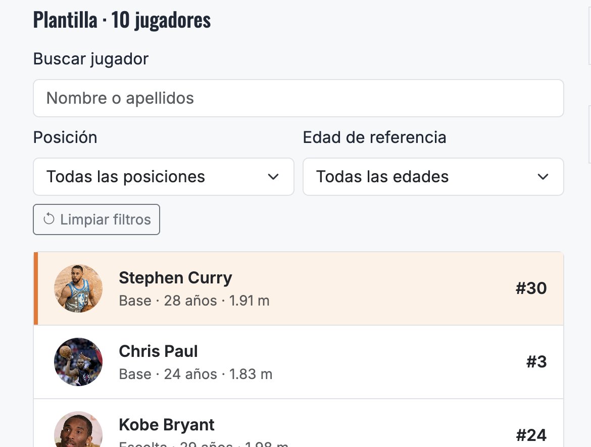
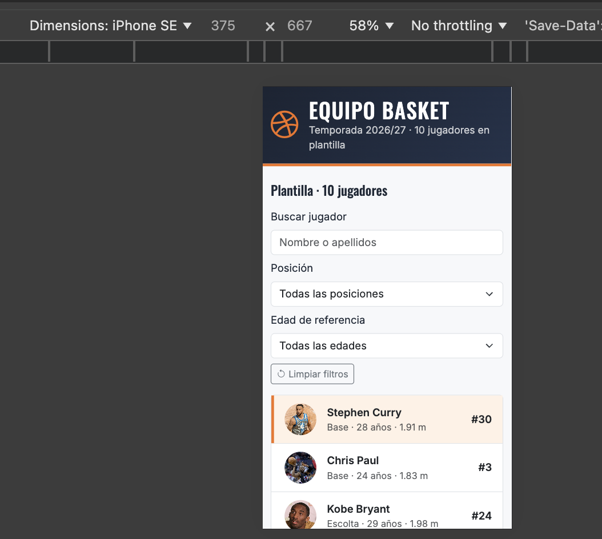
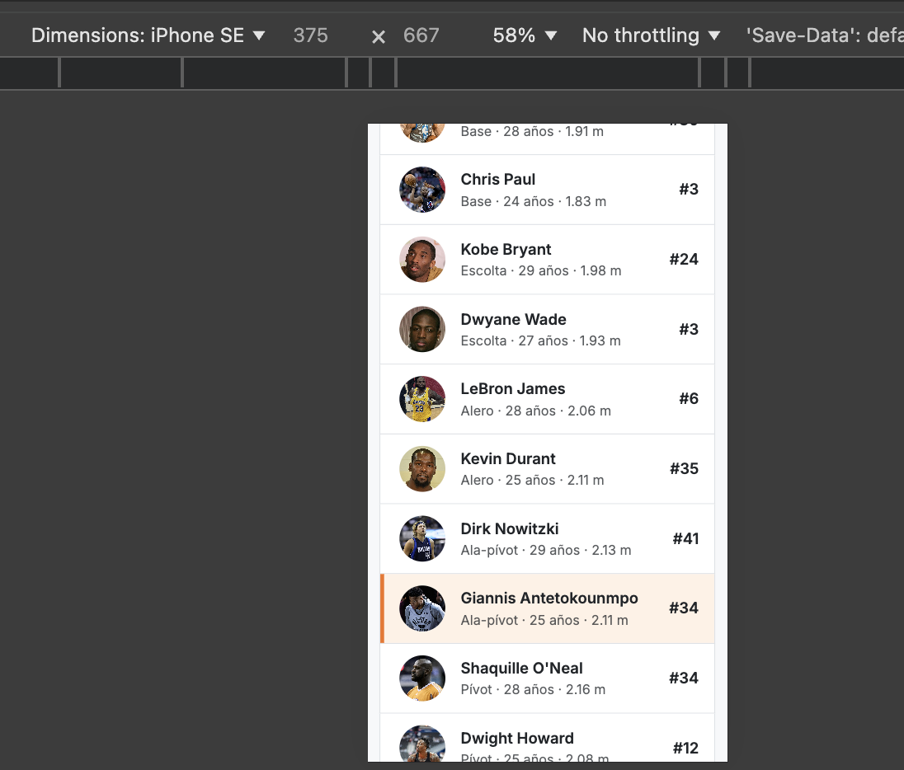

# Datos y PlayersComponent - Aportación de Jacobo

Responsable: Jacobo Barrera Toba. Rama: `feature/jacobo-barrera`. Estado revisado: 8 de octubre de 2026.

Este archivo es material de apoyo para Erick, que lo integrará en el documento técnico común. No sustituye al documento final de entrega. Las capturas y los resultados de la integración se añadirán después de comprobar la versión conjunta.

## 1. Alcance del trabajo

Se ha completado el array local `JUGADORES` con diez jugadores reales, añadido sus fotografías con atribuciones e implementado el listado, la selección y los controles de búsqueda. Se mantienen el modelo y los nombres de comunicación definidos por Erick.

El pipe de filtrado y su conexión al listado corresponden a Marc. El detalle y el reproductor pertenecen a los componentes de Marc y Carles, respectivamente.

### 1.1. Punto de partida y evolución

Erick dejó el proyecto configurado, el modelo `Jugador`, dos objetos de ejemplo, las carpetas multimedia y los componentes comunicados desde `App`. El listado mostraba un texto provisional y tenía declarados sus `@Input` y `@Output`, pero aún no importaba el array ni mostraba jugadores.

La implementación se desarrolló por bloques pequeños, comprobando la compilación y revisando su funcionamiento antes de guardar cada avance. El cambio a jugadores reales se acordó con Erick y Carles; la selección definitiva contiene diez jugadores y dos representantes de cada posición principal.

| Bloque | Cambio realizado | Commit |
|---|---|---|
| Datos | Sustitución de los ejemplos por diez jugadores NBA con referencias históricas. | `dbdf636` |
| Listado inicial | Importación de datos, recorrido con `*ngFor` y presentación de los campos. | `8190cc7` |
| Interacción | Selección, resaltado, controles de búsqueda y alternativa de iniciales si falta una foto. | `90806e8` |
| Fotografías | Diez imágenes locales, créditos y ajuste del encuadre de los avatares. | `8d6268f` |

Estos commits pertenecen a la rama de Jacobo. Su publicación en esa rama no implica que estén integrados en `develop` o `main`.

## 2. Archivos de esta aportación

| Archivo o carpeta | Finalidad |
|---|---|
| `src/app/data/jugadores.data.ts` | Array exportado de diez jugadores con todos los campos del modelo y fuentes de los datos. |
| `src/app/components/players/players.component.ts` | Datos del listado, selección, valores de los controles y gestión de fotos no disponibles. |
| `src/app/components/players/players.component.html` | Listado, campos visibles, controles, eventos y enlace a los créditos. |
| `src/app/components/players/players.component.css` | Resaltado, foco de teclado, avatares y ajuste de nombres largos. |
| `public/assets/img/jugadores/` | Diez fotografías JPEG y `ATRIBUCIONES.md`. |
| `docs/arquetipos-jacobo.md` | Dos perfiles ficticios de usuario y su relación con el diseño. |

## 3. Datos y multimedia compartidos

Cada jugador tiene identificador, nombre, apellidos, dorsal, posición, edad, altura, peso, nacionalidad, rutas de foto y vídeo, descripción y estadísticas. Las estadísticas son medias de temporada regular. La descripción identifica la temporada; la edad se calcula a 30 de junio del año final. La altura y el peso son aproximaciones de fichas biográficas, no mediciones de esa temporada.

Se conserva la declaración `export const JUGADORES: Jugador[]`. `export` permite utilizar la constante desde otros archivos y `Jugador[]` indica un array cuyos objetos deben cumplir el modelo común. El modelo ayuda a detectar campos ausentes o valores de tipo incorrecto durante la compilación; no descarga información ni valida datos externos en tiempo de ejecución.

La temporada se recoge en `descripcion` para mantener la estructura del modelo acordado sin añadir campos que afecten a los componentes de los compañeros. Los nombres y apellidos están separados para mostrar ambos campos y facilitar la búsqueda posterior.

| ID | Jugador | Posición principal | Temporada de referencia |
|---|---|---|---|
| 1 | Stephen Curry | Base | 2015-16 |
| 2 | Chris Paul | Base | 2008-09 |
| 3 | Kobe Bryant | Escolta | 2007-08 |
| 4 | Dwyane Wade | Escolta | 2008-09 |
| 5 | LeBron James | Alero | 2012-13 |
| 6 | Kevin Durant | Alero | 2013-14 |
| 7 | Dirk Nowitzki | Ala-pívot | 2006-07 |
| 8 | Giannis Antetokounmpo | Ala-pívot | 2019-20 |
| 9 | Shaquille O'Neal | Pívot | 1999-2000 |
| 10 | Dwight Howard | Pívot | 2010-11 |

Las fotografías están en `public/assets/img/jugadores/jugador-ID.jpg`. En el array, la ruta comienza por `assets/`, sin `public/`. Sus autores, procedencia y licencias están en [ATRIBUCIONES.md](../public/assets/img/jugadores/ATRIBUCIONES.md). Las imágenes ilustran al jugador, sin asegurar que pertenezcan a la temporada elegida.

Las rutas de vídeo previstas son `assets/videos/jugador-ID.mp4`, con el mismo ID de la tabla. Los vídeos están pendientes de la aportación de Carles. Los dorsales pueden repetirse porque los jugadores proceden de equipos y épocas distintos; el identificador único es `id`.

## 4. Funcionamiento del listado

### 4.1. Organización del componente

El componente conserva el selector `app-players`, utilizado por `App` mediante la etiqueta `<app-players>`. `templateUrl` vincula el HTML y `styleUrl` vincula el CSS. El TypeScript contiene datos y acciones, la plantilla describe lo que se muestra y los estilos definen su presentación.

```ts
imports: [NgFor, NgIf, FormsModule],
```

Este apartado del decorador habilita las directivas y herramientas usadas por la plantilla. `NgFor` y `NgIf` se utilizan conforme al enunciado y al contrato del equipo; `FormsModule` permite conectar los controles con las variables mediante `ngModel`. Se mantiene la estrategia `ChangeDetectionStrategy.Eager` que configuró Erick.

### 4.2. Lectura de los datos y generación de filas

```ts
import { JUGADORES } from '../../data/jugadores.data';

jugadores: Jugador[] = JUGADORES;
```

La propiedad `jugadores` referencia el array exportado. Los datos permanecen en un archivo independiente, evitando introducir los objetos directamente en el componente y cumpliendo el requisito de la rúbrica sobre la constante exportada.

```html
<li *ngFor="let jugador of jugadores" class="list-group-item p-0">
```

Angular genera una fila por cada objeto. Dentro de cada repetición, `jugador` representa el objeto de esa fila. La interpolación muestra sus valores:

```html
{{ jugador.nombre }} {{ jugador.apellidos }}
{{ jugador.posicion }} · {{ jugador.edad }} años · {{ jugador.altura }} m
```

También se muestra el dorsal y la fotografía. Por tanto, la fila presenta seis campos textuales del modelo, además de la imagen. El encabezado utiliza `jugadores.length` para indicar el total de jugadores del array; actualmente no representa un recuento de resultados filtrados.

### 4.3. Fotografías y alternativa cuando fallan

```html
[src]="jugador.foto"
[alt]="'Foto de ' + jugador.nombre + ' ' + jugador.apellidos"
(error)="marcarFotoNoDisponible(jugador.id)"
```

`[src]` enlaza la propiedad de la imagen con la ruta almacenada en los datos. El texto alternativo identifica a la persona. Si la carga falla, el evento `error` llama al método que registra el ID:

```ts
fotosNoDisponibles = new Set<number>();

marcarFotoNoDisponible(id: number): void {
  this.fotosNoDisponibles.add(id);
}
```

El `Set` evita guardar identificadores repetidos. La condición `*ngIf="!fotosNoDisponibles.has(jugador.id); else iniciales"` decide entre la imagen y una plantilla alternativa que muestra la primera letra del nombre y del apellido. Así se conserva el espacio del avatar sin mostrar una imagen rota. Las iniciales llevan `aria-hidden="true"` porque el nombre completo ya está visible en el botón.

El registro de errores dura mientras existe esa instancia del componente. Si se añade una foto que antes faltaba, recargar la página reinicia ese registro y permite volver a intentar cargarla.

### 4.4. Estado vacío

La condición `*ngIf="jugadores.length === 0"` muestra un mensaje cuando el array no tiene elementos. El array actual contiene diez, de modo que ese estado no aparece normalmente.

La condición todavía no consulta los resultados de una búsqueda. Marc debe actualizarla al integrar el pipe para que un filtro sin coincidencias muestre el mensaje correspondiente.

### 4.5. Presentación, adaptación y accesibilidad

Cada fila contiene un botón de tipo `button`, evitando el envío de formularios y permitiendo activarla mediante teclado. `aria-pressed` comunica si está seleccionada y `:focus-visible` añade un contorno al navegar con teclado.

El resaltado combina el fondo `--eb-naranja-suave` con un borde izquierdo `--eb-naranja`. La señal no depende únicamente de cambiar el color del texto. Se reutilizan los colores globales definidos por Erick para mantener coherencia con el resto de la aplicación.

Los avatares mantienen 48 por 48 píxeles mediante dimensiones fijas y `flex-shrink: 0`. `object-fit: cover` llena el círculo sin estirar la foto; `object-position: center top` prioriza la parte superior. Este encuadre visual no modifica el archivo JPEG.

El bloque de datos utiliza `min-width: 0` y `overflow-wrap: anywhere` para que apellidos largos, como Antetokounmpo, puedan ajustarse al espacio disponible. Los desplegables usan `col-sm-6`: se distribuyen en dos columnas a partir del ancho `sm` de Bootstrap y se apilan por debajo. Los controles tienen etiquetas visibles asociadas mediante `for` e `id`.

Se ha añadido un enlace a los créditos bajo el listado para mantener accesibles las atribuciones desde la aplicación, además de conservarlas en el repositorio.

## 5. Comunicación con App

La selección se conserva en el componente padre `App`, no en una segunda variable independiente del listado. Se reutiliza el contrato de comunicación que preparó Erick:

```ts
@Input() idSeleccionado: number | null = null;
@Output() jugadorSeleccionado = new EventEmitter<Jugador>();

seleccionar(jugador: Jugador): void {
  this.jugadorSeleccionado.emit(jugador);
}
```

`@Input` recibe el ID que debe resaltarse; `null` representa la ausencia de selección. `@Output` permite avisar al padre mediante un evento que transporta el objeto completo. No se envía solo el nombre o el ID, porque la ficha y el reproductor necesitan acceder a todos sus campos.

El botón de cada fila tiene `(click)="seleccionar(jugador)"`. El recorrido completo es:

1. El clic ejecuta `seleccionar(jugador)` en el listado.
2. La función emite el objeto completo mediante `@Output() jugadorSeleccionado`.
3. `App`, preparado por Erick, lo recibe y lo guarda en `jugadorActual`.
4. `App` pasa el jugador al detalle y al reproductor, y devuelve su ID al listado mediante `@Input() idSeleccionado`.
5. El listado compara el ID de cada fila con `idSeleccionado` para aplicar la clase `seleccionado`.

Esta aportación no modifica `App`. La comunicación para cerrar el detalle también está preparada allí, pero la acción de cierre debe implementarse y comprobarse en el componente de Marc.

```html
[class.seleccionado]="jugador.id === idSeleccionado"
```

Esta expresión añade o retira la clase CSS según la comparación de identificadores. Al seleccionar otro jugador, `App` devuelve el nuevo ID y el resaltado cambia de fila. Cuando el detalle emita `cerrar` y `App` restablezca la selección a `null`, ninguna fila deberá permanecer resaltada.

## 6. Controles preparados para el pipe de Marc

### 6.1. Variables y enlace bidireccional

```ts
posiciones = POSICIONES;
textoBusqueda = '';
posicionSeleccionada = '';
rangoEdad = '';
```

`POSICIONES` procede del modelo común, evitando definir otra lista de posiciones en el HTML. El buscador utiliza `[(ngModel)]="textoBusqueda"`; los desplegables utilizan las otras dos variables. El enlace es bidireccional: escribir o elegir una opción actualiza la variable, y cambiar la variable desde TypeScript actualiza el control.

El botón llama al siguiente método:

```ts
limpiarFiltros(): void {
  this.textoBusqueda = '';
  this.posicionSeleccionada = '';
  this.rangoEdad = '';
}
```

El método restablece el buscador y las opciones iniciales sin modificar el array original ni cambiar el jugador seleccionado. `FormsModule` habilita este uso de `ngModel` en la plantilla.

### 6.2. Valores acordados para la integración

| Variable | Control | Valores previstos |
|---|---|---|
| `textoBusqueda` | Buscador de nombre o apellidos | Texto libre; `''` significa sin búsqueda. |
| `posicionSeleccionada` | Desplegable de posición | Valores exactos de `POSICIONES`; `''` significa todas. |
| `rangoEdad` | Desplegable de edad de referencia | `sub23`, `23-29`, `30+`; `''` significa todas. |

Los valores de edad acordados son `sub23`, `23-29` y `30+`; texto vacío significa no aplicar ese filtro. Las posiciones proceden de `POSICIONES` en el modelo común. Marc debe importar su pipe, habilitarlo en el componente y aplicarlo tanto al recorrido del listado como a la condición del mensaje sin resultados, coordinándose con Jacobo.

Actualmente los controles almacenan valores, pero no filtran: `*ngFor` sigue recorriendo el array completo. Todas las edades de referencia están entre 23 y 29 años, por lo que los otros rangos producirán cero resultados una vez integrado el pipe. No se han inventado edades para llenar esos rangos.

### 6.3. Casos que se deben probar después de conectar el pipe

- Buscar `Curry`: debe aparecer Stephen Curry.
- Seleccionar `Pívot`: deben aparecer Shaquille O'Neal y Dwight Howard.
- Combinar `Pívot` y el texto `Howard`: debe quedar Dwight Howard.
- Seleccionar `30+` o `sub23`: debe aparecer el mensaje sin resultados con estos datos históricos.
- Buscar un texto inexistente: debe aparecer el mensaje sin resultados.
- Limpiar los controles: deben reaparecer los diez jugadores.
- Seleccionar un jugador y aplicar un filtro que lo oculte: acordar con el equipo si se conserva su ficha o se limpia la selección. Actualmente limpiar controles no cierra la ficha.

Estos son resultados esperados para la integración; no se presentan como pruebas ya realizadas.

## 7. Comprobaciones y evidencias pendientes

- Comprobaciones ejecutadas: compilación de TypeScript y de plantillas con `ngc --noEmit`, diez IDs únicos, campos completos, dos jugadores por posición y correspondencia de rutas.
- Fotografías verificadas: diez JPEG válidos de menos de 150 KB cada uno, con revisión visual y atribuciones contrastadas en Commons.
- Pruebas manuales comunicadas por Jacobo: funcionamiento de la interfaz, carga de fotos y revisión en vista móvil y escritorio. El tamaño aparente en Chrome se corrigió al restablecer el zoom.
- Pendiente en la versión integrada: filtrado combinado, mensaje sin resultados por filtrado, cierre del detalle, reproducción de los diez vídeos y comprobación online en StackBlitz.
- Capturas incorporadas: vista parcial del listado con Stephen Curry seleccionado y simulación móvil de 375 por 667 píxeles en Chrome. Pendientes: listado completo en escritorio y controles antes/después de limpiar. Añadir capturas de filtrado después de integrar el pipe; no presentar controles sin conectar como filtros funcionales.
- Arquetipos: texto preparado en [arquetipos-jacobo.md](arquetipos-jacobo.md); faltan las fichas visuales y sus avatares o ilustraciones.

### 7.1. Evidencia de selección



**Figura 1.** Captura aportada por Jacobo: Stephen Curry aparece resaltado mediante fondo naranja suave y borde izquierdo naranja. Se observan las fotografías, los campos de las filas y los controles de búsqueda y posición/edad. El encabezado indica diez jugadores, pero el recorte no muestra el listado completo ni los componentes de detalle y vídeo. La imagen acredita la presentación del estado seleccionado, no el filtrado ni la reproducción multimedia.

### 7.2. Evidencia de adaptación a móvil



**Figura 2.** Captura aportada por Jacobo en el modo de dispositivos de Chrome: viewport de 375 por 667 píxeles, con previsualización al 58 %. El buscador y los desplegables se distribuyen verticalmente. En las filas visibles caben la foto, el nombre, los datos y el dorsal, y se conserva el resaltado de Curry. Esta evidencia corresponde a una simulación, no a una prueba en un iPhone físico, y no permite verificar las filas que quedan fuera del área capturada ni el detalle y el vídeo situados más abajo.

### 7.3. Nombre largo y cambio de selección en móvil



**Figura 3.** Captura aportada por Jacobo en la misma simulación de 375 por 667 píxeles. La fila de Giannis Antetokounmpo muestra su nombre completo, posición, edad, altura y dorsal dentro del ancho visible, sin solapamientos. El resaltado aparece en Giannis tras seleccionar otro jugador. Esta captura complementa la revisión de la parte superior del listado con el caso del apellido más largo; no acredita por sí sola el funcionamiento del detalle o del reproductor.

## 8. Referencias y entrega a Erick

Las fuentes de estadísticas y datos biográficos están junto a cada objeto de `jugadores.data.ts`; las fuentes de las fotografías están en `ATRIBUCIONES.md`. Erick puede incorporar esas referencias a la bibliografía común y utilizar los apartados anteriores como base de la explicación del listado.

### 8.1. Información para cada integrante

| Integrante | Información que necesita de esta aportación |
|---|---|
| Erick | Revisar la PR a `develop`, integrar el componente y usar este documento como explicación técnica de la parte de Jacobo. |
| Marc | Conservar el contrato de selección y coordinar los cambios del pipe en los archivos de `PlayersComponent`; probar resultados vacíos y filtros combinados. |
| Carles | Utilizar la tabla de IDs para nombrar los diez vídeos y leer la ruta `video` del jugador recibido. |
| Jacobo | Añadir capturas, preparar las fichas visuales de arquetipos y colaborar en las comprobaciones de integración. |

### 8.2. Capturas que se incorporarán al documento común

| Evidencia | Qué debe demostrar | Momento |
|---|---|---|
| Listado en escritorio | Datos, fotografías y controles visibles. | Versión actual. |
| Jugador seleccionado | Resaltado de la fila y comunicación con los componentes disponibles. | Actual para la selección; repetir cuando detalle y vídeo estén completos. |
| Vista móvil | Nombres ajustados, controles apilados y ausencia de desplazamiento horizontal. | Versión actual. |
| Limpiar controles | Buscador y desplegables restablecidos. | Versión actual; no demuestra filtrado. |
| Búsqueda y filtros combinados | Resultados coherentes y recuperación de la lista al limpiar. | Después de integrar el pipe. |
| Sin coincidencias | Mensaje de estado vacío provocado por una búsqueda. | Después de integrar el pipe. |

Este documento reúne la explicación técnica y la información de entrega; no hace falta crear otra ficha técnica con el mismo contenido. Antes de enviarlo al equipo, adjuntar las capturas disponibles, indicar la PR correspondiente y actualizar los pendientes según el estado real de la integración. El mensaje de acompañamiento puede limitarse a señalar el enlace de la PR, este archivo y los pasos que necesitan Marc y Carles.
